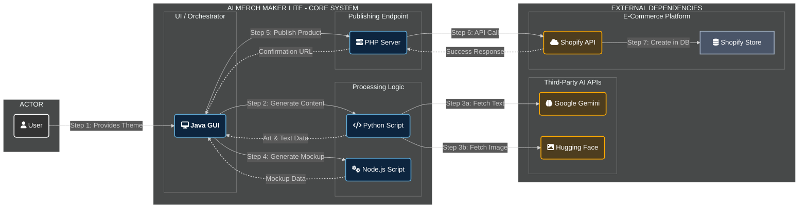

# AI Merch Maker Lite

*Your Personal, Automated Print-on-Demand Factory.*


AI Merch Maker Lite bridges the gap between raw creativity and e-commerce. It is a desktop application designed to eliminate the manual labor of creating and listing print-on-demand products. By leveraging a suite of modern AI tools and a polyglot architecture, this project transforms a simple text-based theme into a fully-realized, market-ready product in a Shopify store, all with a single click.

---

## Visual Architecture

Here is a visual representation of the project's architecture and workflow.



-----

---

## Project Showcase: A Step-by-Step Visual Walkthrough

This section visually documents the entire project workflow, from generating an idea in the application to seeing a fully functional product on the live e-commerce store.

<table width="100%">
  <tr>
    <td align="center" valign="top">
      <b>1. GUI Success</b><br><br>
      <a href="https://i.ibb.co/rGjW5pt9/Screenshot-2025-08-03-230537.png" target="_blank">
        
      </a>
      <br><small><i>The application's command center after a successful run. The log on the left confirms each stage of the pipeline completed, and the final Shopify product URL is displayed. The generated t-shirt mockup is shown on the right.</i></small>
    </td>
    <td align="center" valign="top">
      <b>2. GUI Details Tab</b><br><br>
      <a href="https://i.ibb.co/3m4RFg0n/Screenshot-2025-08-03-230548.png" target="_blank">
        
      </a>
      <br><small><i>The 'Product Details' tab within the application. This demonstrates that the AI-generated title, description, and tags were successfully captured and displayed by the GUI.</i></small>
    </td>
  </tr>
  <tr>
    <td align="center" valign="top">
      <b>3. Programmatic Upload / Shopify Product List</b><br><br>
      <a href="https://i.ibb.co/CKtgbBkF/Screenshot-2025-08-03-230623.png" target="_blank">
        
      </a>
      <br><small><i>The Shopify admin dashboard. The newly created product ("Skyline Serenade") appears at the top of the list with a 'Draft' status, confirming the programmatic upload was successful.</i></small>
    </td>
    <td align="center" valign="top">
      <b>4. Shopify Product in Draft</b><br><br>
      <a href="https://i.ibb.co/7JpyyPCj/Screenshot-2025-08-03-230851.png" target="_blank">
        
      </a>
      <br><small><i>Reviewing the new product in Shopify. This screen shows all the AI-generated content (title, description, media) populated correctly, with the status ready to be changed from 'Draft' to 'Active'.</i></small>
    </td>
  </tr>
  <tr>
    <td align="center" valign="top">
      <b>5. Shopify Product Active</b><br><br>
      <a href="https://i.ibb.co/99xTm95C/Screenshot-2025-08-03-230956.png" target="_blank">
        
      </a>
      <br><small><i>The product after its status has been manually changed to 'Active' in the Shopify admin, making it ready to be published to the live storefront.</i></small>
    </td>
    <td align="center" valign="top">
      <b>6. Live Store Catalog</b><br><br>
      <a href="https://i.ibb.co/SDmsf8vp/Screenshot-2025-08-03-232007.png" target="_blank">
        
      </a>
      <br><small><i>The public-facing storefront catalog. The newly activated product now appears alongside other creations, available for customers to browse and purchase.</i></small>
    </td>
  </tr>
  <tr>
    <td align="center" valign="top">
      <b>7. Live Product Page</b><br><br>
      <a href="https://i.ibb.co/8nVK6DB5/Screenshot-2025-08-03-232019.png" target="_blank">
        
      </a>
      <br><small><i>The live customer view of a product page. This demonstrates the final result, featuring the product images, description, price, and the "Add to cart" button.</i></small>
    </td>
    <td align="center" valign="top">
      <b>8. Live Checkout Page</b><br><br>
      <a href="https://i.ibb.co/f4wskgC/Screenshot-2025-08-03-232058.png" target="_blank">
        
      </a>
      <br><small><i>The fully functional checkout page, demonstrating the store is ready to process real orders.</i></small>
    </td>
  </tr>
</table>

---

## Core Philosophy

To empower creators by **automating the mundane**, freeing them to focus on high-level ideas, not repetitive execution. This tool acts as a tireless digital assistant, handling the entire product creation workflow from concept to publication.

-----

## Key Features

  - ✨ **AI-Powered Creativity**: Instantly generates compelling product titles, engaging descriptions, and SEO-friendly tags from a simple theme using Google's Gemini Pro.
  - 🎨 **Unique Artwork on Demand**: Produces original, high-quality artwork using the Stable Diffusion model via the Hugging Face API, ensuring every product is visually distinct.
  - 👕 **Automated Mockup Generation**: Dynamically composites the generated artwork onto a t-shirt template, providing an instant, realistic product mockup for your storefront.
  - 🚀 **Direct-to-Store Publishing**: Seamlessly creates a new product in your Shopify store via API, complete with all generated text, artwork, mockup images, and metadata.
  - 🖥️ **Unified Command Center**: A robust, multi-threaded Java Swing GUI acts as the central orchestrator, providing a clear user interface and a real-time log of the entire process.
  - 🔗 **Interactive Feedback Loop**: The live log provides status updates for each stage and concludes with a clickable link that takes you directly to the newly created product in your Shopify admin panel.

-----

## The Digital Assembly Line: How It Works

The application functions as a sophisticated, multi-language assembly line, where each component performs a specialized task before passing the product to the next stage.

```plaintext
 [ User Input: Creative Theme ]
              |
              V
[ 1. Java GUI Command Center ]
     (Initiates Pipeline)
              |
              V
[ 2. Python Content & Art Forge ] --- (Gemini & Hugging Face APIs)
     (Generates Text & Artwork)
              |
              V
[ 3. Node.js Mockup Studio ]
     (Overlays Art on Template)
              |
              V
[ 4. PHP Publishing Gateway ]
     (Sends Final Product to Shopify)
              |
              V
[ 5. Shopify Store ] --- (Shopify Admin API)
     (New Product Appears as Draft)
```

-----


## Deep Dive: The Shopify Integration

The final and most critical step is handled by the **PHP Publishing Gateway**. This lightweight local server (`index.php`) acts as the bridge between the application and your Shopify store.

1.  **Receives Finalized Data**: The Java orchestrator sends a complete JSON package containing all text and image file paths to the PHP endpoint.
2.  **Authenticates Securely**: It loads your private Shopify credentials from a local `config.php` file, ensuring they remain secure.
3.  **Prepares Media for Upload**: It reads the artwork and mockup image files from your disk and encodes them into Base64 format. This is the standard method for embedding images directly into an API call without needing to host them publicly first.
4.  **Constructs API Payload**: It meticulously builds a JSON object that adheres to the strict structure required by the Shopify Products API endpoint.
5.  **Executes the API Call**: Using PHP's cURL library, it sends the payload to your store's unique `/admin/api/products.json` URL.
6.  **Confirms Creation**: It waits for a `201 Created` HTTP status from Shopify, confirming the product was successfully created. It then relays this success, along with a direct admin URL, back to the Java GUI.

-----

## Getting Started: A Step-by-Step Guide

### 1\. Prerequisites

Ensure the following software is installed on your system:

  - Java Development Kit (JDK 11+)
  - Python (3.8+)
  - Node.js & npm (14+)
  - PHP (8.0+)

### 2\. Configuration: The Keys to the Factory

You must provide API keys for the AI services and Shopify.

#### **A. AI Service Keys**

1.  In the project's root directory, create a file named `.env`.
2.  Add your keys from Google and Hugging Face:
    ```ini
    GEMINI_API_KEY="your-google-gemini-api-key"
    HUGGINGFACE_API_KEY="your-hugging-face-api-key"
    ```

#### **B. Shopify Credentials**

1.  **Generate Shopify API Access**:
      - In your Shopify admin, go to **Settings \> Apps and sales channels \> Develop apps**.
      - Create an app, go to the **Configuration** tab, and configure **Admin API integration**.
      - Grant it **`write_products`** and **`read_products`** permissions.
      - Install the app and copy the **Admin API access token** (it starts with `shpat_`).
2.  **Create `config.php`**:
      - In the `product_publisher_php/` directory, create a file named `config.php`.
      - Add your store URL and the access token you just copied:
        ```php
        <?php
        define('SHOPIFY_STORE_URL', 'https://your-store-name.myshopify.com');
        define('SHOPIFY_API_ACCESS_TOKEN', 'shpat_xxxxxxxxxxxxxxxxxxxxxxxxxxxxx');
        ?>
        ```

### 3\. Install Dependencies

**Python:**

```powershell
pip install google-generativeai python-dotenv requests
```

**Node.js:**

```powershell
cd mockup_visualizer
npm install
cd ..
```

-----

## Launch Sequence

The application requires two processes running simultaneously in two separate terminals from the project root.

#### **Terminal 1: Activate the Publishing Gateway**

This command starts the local PHP server that waits to receive the final product data.

```powershell
php -S 127.0.0.1:8000 -t product_publisher_php
```

*Leave this terminal running.*

#### **Terminal 2: Launch the Command Center**

This command compiles and runs the main Java application.

```powershell
# Navigate to the Java source directory
cd automation_orchestrator_java

# Compile the Java code
javac -cp ".;../lib/json.jar" Orchestrator.java

# Run the application
java -cp ".;../lib/json.jar" Orchestrator
```

The GUI will now launch. Enter your creative theme and click "Generate & Publish" to start the magic.

-----

## Technical Blueprint

  - **GUI & Orchestration**: Java (Swing)
  - **Core Backend Logic**: Python 3, Node.js, PHP 8
  - **Libraries**:
      - Java: `org.json`
      - Python: `google-generativeai`, `python-dotenv`, `requests`
      - Node.js: `jimp`
  - **APIs & Services**:
      - Google Gemini API
      - Hugging Face Inference API (for Stable Diffusion)
      - Shopify Admin API

-----

## Project Structure

```
ai_merch_maker_lite/
├── automation_orchestrator_java/   # Main Java GUI and pipeline controller
│   └── Orchestrator.java
├── content_generator/              # Python script for AI content and art
│   └── main.py
├── generated_products/             # Output folder for all generated images
│   └── (artworks and mockups appear here)
├── lib/                            # Java dependencies
│   └── json.jar
├── mockup_visualizer/              # Node.js script for creating mockups
│   ├── main.js
│   └── tshirt_template.png
├── product_publisher_php/          # PHP script for publishing to Shopify
│   ├── index.php
│   └── config.php (must be created)
├── .env                            # Stores API keys for AI services
├── .gitignore
└── README.md
```


